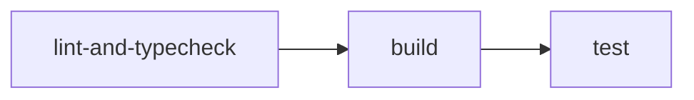

# GitHub Actions Workflows

This directory contains CI/CD workflows for the BeStaff Mobile monorepo.

## 📋 Workflows Overview

| Workflow | File | Trigger | Status |
|----------|------|---------|--------|
| **CI** | `ci.yml` | Push/PR to `main`, `develop` | ✅ Active |
| **Deploy Docs** | `deploy-docs.yml` | Push to `main` (docs changes) | ⏸️ Disabled |

---

## 🔄 CI Workflow (`ci.yml`)

### Purpose
Continuous Integration pipeline that runs on every push and pull request to ensure code quality and build integrity.

### Jobs



#### 1. Lint & Type Check
- Runs ESLint across all workspaces
- Performs TypeScript type checking
- **Fails fast** if code quality issues are found

#### 2. Build Packages
- Builds all packages in `packages/*` directory
- Ensures all shared packages compile correctly
- Runs after lint passes

#### 3. Run Tests
- Executes test suites across workspaces
- Runs after build completes successfully

### Configuration

| Setting | Value |
|---------|-------|
| Node.js Version | From `.nvmrc` (v20.14.0) |
| Package Manager | pnpm 9.15.0 |
| Concurrency | Cancels previous runs on same branch |

### Triggers

```yaml
on:
  push:
    branches: [main, develop]
  pull_request:
    branches: [main, develop]
```

### Required Secrets
None - this workflow uses no external secrets.

---

## 📚 Deploy Docs Workflow (`deploy-docs.yml`)

### Status: ⏸️ **DISABLED**

This workflow is currently disabled because the referenced documentation app (`apps/orbit-web`) does not exist in the repository.

### Current Apps in Repository
- `apps/mobile-app` - Main React Native mobile application
- `apps/mobile-storybook` - Component development environment

### To Enable This Workflow

1. **Create a documentation app** (recommended options):
   - [Docusaurus](https://docusaurus.io/) - React-based docs framework
   - [VitePress](https://vitepress.dev/) - Vue-powered static site generator
   - [Nextra](https://nextra.site/) - Next.js based docs theme

2. **Update workflow configuration**:
   ```yaml
   paths:
     - "apps/docs/**"  # Update to your docs app path
   ```

3. **Configure Vercel secrets** (required):
   - `VERCEL_TOKEN` - Vercel API token
   - `VERCEL_ORG_ID` - Your Vercel organization ID
   - `VERCEL_PROJECT_ID` - Your Vercel project ID

4. **Remove the `if: false` condition** from the job

### Required Secrets (when enabled)

| Secret | Description | How to Get |
|--------|-------------|------------|
| `VERCEL_TOKEN` | API token for Vercel deployment | [Vercel Dashboard → Settings → Tokens](https://vercel.com/account/tokens) |
| `VERCEL_ORG_ID` | Organization/Team ID | Found in `.vercel/project.json` after `vercel link` |
| `VERCEL_PROJECT_ID` | Project ID | Found in `.vercel/project.json` after `vercel link` |

---

## 🛠️ Local Development

### Running CI Checks Locally

Before pushing, you can run the same checks locally:

```bash
# Install dependencies
pnpm install

# Run lint
pnpm lint

# Fix lint issues automatically
pnpm lint:fix

# Type check
pnpm check-types

# Build packages
pnpm build:packages

# Run tests
pnpm test
```

### Pre-commit Hooks

This repository uses [Husky](https://typicode.github.io/husky/) and [lint-staged](https://github.com/okonet/lint-staged) for pre-commit checks:

- **Prettier** - Formats code on commit
- **ESLint** - Lints and fixes JavaScript/TypeScript files

---

## 📊 Workflow Status Badges

Add these badges to the main README.md:

```markdown
[](https://github.com/quang-pham-dev/bestaff-mobile/actions/workflows/ci.yml)
```

---

## 🔧 Troubleshooting

### Common Issues

#### 1. `pnpm-lock.yaml` out of sync
```
Error: Lockfile is not up to date
```
**Solution**: Run `pnpm install` locally and commit the updated lockfile.

#### 2. Type errors in CI but not locally
**Cause**: Different TypeScript or dependency versions.
**Solution**: Ensure you're using Node.js v20.14.0 (check `.nvmrc`).

#### 3. Build fails on packages
**Cause**: Missing peer dependencies or circular imports.
**Solution**: Check package dependency graph with `pnpm why <package>`.

### Debugging Workflows

1. Check workflow run logs in GitHub Actions tab
2. Use `act` for local workflow testing: https://github.com/nektos/act
3. Enable debug logging:
   ```yaml
   env:
     ACTIONS_STEP_DEBUG: true
   ```

---

## 📅 Maintenance

### Regular Updates
- **Monthly**: Update action versions (checkout, setup-node, pnpm)
- **On dependency updates**: Ensure CI still passes
- **On new packages**: Verify they're included in build/test

### Version History

| Date | Change |
|------|--------|
| 2025-12-06 | Fixed workflows: pnpm setup, Node.js version, disabled deploy-docs |
| Initial | Created basic npm-based CI workflow |

---

## 📝 Contributing

When modifying workflows:

1. Test changes on a feature branch first
2. Use meaningful commit messages
3. Update this README if adding new workflows
4. Ensure secrets are documented (never commit actual secrets!)
