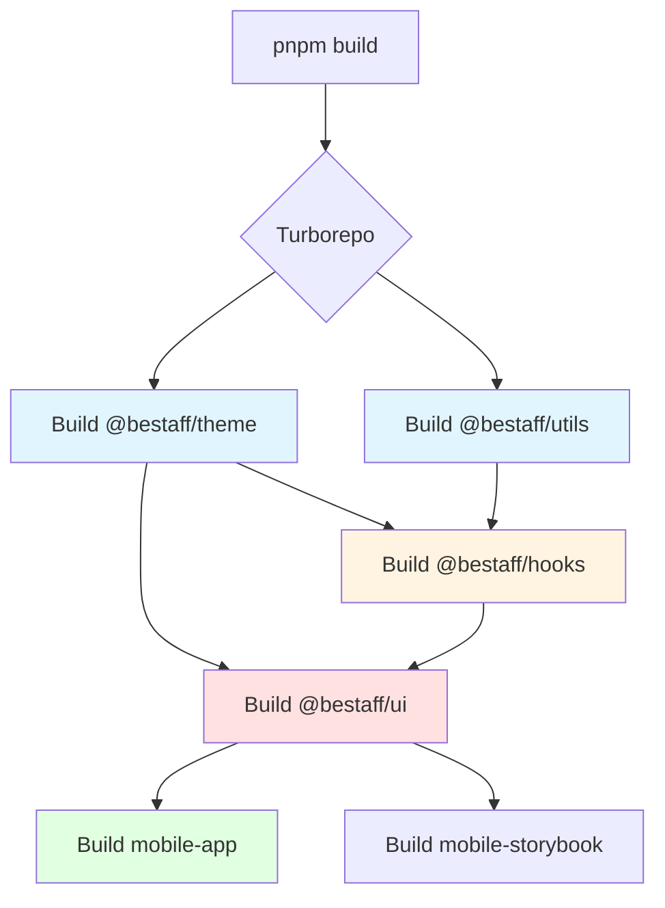

# BeStaff Mobile - Architecture Documentation

> **Last Updated:** December 1, 2025  
> **Version:** 1.0.0  
> **Author:** Architecture Team

## Executive Summary

BeStaff Mobile is a **production-ready, enterprise-grade React Native mobile application** built with modern architectural patterns and best practices. The project leverages a **monorepo architecture** managed by Turborepo and pnpm workspaces, enabling optimal code sharing, type safety, and developer experience across the entire mobile ecosystem.

### Key Architectural Highlights

- 🏗️ **Monorepo Architecture**: Turborepo-powered build system with intelligent caching and parallel execution
- 📦 **Package-Based Design**: 5 core packages with clear separation of concerns and dependency boundaries
- 🎨 **Design System First**: Centralized theming with design tokens and factory-based styling
- 📱 **File-Based Routing**: Expo Router 6 for type-safe, intuitive navigation
- 🔄 **Modern State Management**: TanStack Query for server state, React Context for UI state
- 📊 **Production Logging**: Structured logging infrastructure with Pino
- ✅ **Type Safety**: Full TypeScript coverage with strict type checking

---

## Table of Contents

1. [System Overview](#1-system-overview)
2. [Technology Stack](#2-technology-stack)
3. [Monorepo Architecture](#3-monorepo-architecture)
4. [Project Structure](#4-project-structure)
5. [Core Packages](#5-core-packages)
6. [Application Architecture](#6-application-architecture)
7. [Design System](#7-design-system)
8. [State Management](#8-state-management)
9. [Routing & Navigation](#9-routing--navigation)
10. [Build & Deployment](#10-build--deployment)
11. [Testing Strategy](#11-testing-strategy)
12. [Development Workflow](#12-development-workflow)
13. [Performance Optimizations](#13-performance-optimizations)
14. [Security Considerations](#14-security-considerations)

---

## 1. System Overview

### 1.1 Architecture Philosophy

The BeStaff Mobile architecture is built on the following core principles:

1. **Modularity**: Clear package boundaries with well-defined responsibilities
2. **Type Safety**: TypeScript-first approach with strict type checking
3. **Developer Experience**: Fast build times, hot reload, and excellent tooling
4. **Scalability**: Architecture designed to grow with team and codebase
5. **Maintainability**: Consistent patterns, documentation, and code standards

### 1.2 High-Level Architecture

```mermaid
graph TB
    subgraph "Mobile Application Layer"
        APP[Mobile App<br/>Expo + React Native]
        STORY[Storybook<br/>Component Development]
    end
    
    subgraph "Shared Packages Layer"
        UI[UI Components<br/>@bestaff/ui]
        THEME[Design System<br/>@bestaff/theme]
        HOOKS[React Hooks<br/>@bestaff/hooks]
        UTILS[Utilities<br/>@bestaff/utils]
        LOGGER[Logging<br/>@bestaff/logger]
    end
    
    subgraph "Tooling Layer"
        ESLINT[ESLint Config]
        PRETTIER[Prettier Config]
        TSCONFIG[TypeScript Config]
    end
    
    APP --> UI
    APP --> HOOKS
    APP --> LOGGER
    STORY --> UI
    UI --> THEME
    UI --> HOOKS
    UI --> UTILS
    HOOKS --> THEME
    HOOKS --> UTILS
    UTILS --> THEME
    
    APP -.-> ESLINT
    APP -.-> PRETTIER
    APP -.-> TSCONFIG
    UI -.-> ESLINT
    THEME -.-> TSCONFIG
```

---

## 2. Technology Stack

### 2.1 Core Technologies

| Category | Technology | Version | Purpose |
|----------|-----------|---------|---------|
| **Framework** | React Native | 0.81.5 | Mobile framework |
| **Platform** | Expo | 54.0 | Development platform & tooling |
| **Language** | TypeScript | 5.9.2 | Type-safe development |
| **Build System** | Turborepo | 2.6.1 | Monorepo orchestration |
| **Package Manager** | pnpm | 9.15.0 | Fast, disk-efficient package management |
| **UI Library** | React | 19.2.0 | Component framework (React 19!) |

### 2.2 Navigation & Routing

| Library | Version | Purpose |
|---------|---------|---------|
| Expo Router | 6.0.15 | File-based routing system |
| React Navigation | 7.1.8 | Navigation primitives |
| React Navigation Bottom Tabs | 7.4.0 | Tab navigation |

### 2.3 State Management & Data Fetching

| Library | Version | Purpose |
|---------|---------|---------|
| TanStack Query | 5.90.10 | Server state, caching, synchronization |
| React Hook Form | 5.2.2+ | Form state management |
| Zod | 4.1.12 | Schema validation |
| AsyncStorage | 2.2.0 | Persistent local storage |

### 2.4 UI & Animations

| Library | Version | Purpose |
|---------|---------|---------|
| React Native Reanimated | 4.1.1 | High-performance animations |
| React Native Gesture Handler | 2.28.0 | Native touch handling |
| Expo Image | 3.0.10 | Optimized image component |
| Gorhom Bottom Sheet | 5.2.6 | Native bottom sheet modals |

### 2.5 Development Tools

| Tool | Version | Purpose |
|------|---------|---------|
| ESLint | 9.39.1 | Code linting |
| Prettier | 3.6.2 | Code formatting |
| Husky | 9.1.7 | Git hooks |
| Commitlint | 20.1.0 | Commit message linting |
| Vitest | 3.2.4 | Fast unit testing (packages) |
| Jest | 30.2.0 | Unit testing (apps) |

### 2.6 Logging & Monitoring

| Library | Version | Purpose |
|---------|---------|---------|
| Pino | 9.9.4 | High-performance logging |
| Pino Pretty | 13.1.1 | Pretty log formatting (dev) |
| Pino HTTP | 10.3.0 | HTTP request logging |

---

## 3. Monorepo Architecture

### 3.1 Why Monorepo?

The monorepo approach provides several key benefits:

- **Code Sharing**: Share UI components, hooks, utilities across apps
- **Atomic Changes**: Update multiple packages in a single commit
- **Consistent Tooling**: Unified ESLint, TypeScript, Prettier configs
- **Type Safety**: Cross-package type checking
- **Simplified Dependency Management**: Single lock file, consistent versions
- **Build Optimization**: Turborepo caching and parallel execution

### 3.2 Workspace Structure

The monorepo is organized into three main workspace categories:

```
bestaff-mobile/
├── apps/              # Applications (2)
├── packages/          # Shared packages (5)
└── tooling/          # Development tooling (3)
```

#### Workspace Configuration

**[pnpm-workspace.yaml](file:///Users/quangpn/Working-space/Project/bestaff/bestaff-mobile/pnpm-workspace.yaml)**

```yaml
packages:
  - apps/*
  - packages/*
  - tooling/*
```

This configuration uses **pnpm catalogs** for dependency version management:

- `catalog:` - Default catalog (core tools)
- `catalog:react19` - React 19 ecosystem
- `catalog:react-native` - React Native packages
- `catalog:expo54` - Expo SDK 54
- `catalog:eslint-plugins` - ESLint plugins
- `catalog:testing` - Testing libraries

**Benefits:**
- ✅ Single source of truth for versions
- ✅ Consistent dependencies across packages
- ✅ Easy to update versions globally
- ✅ Reduced package.json duplication

### 3.3 Turborepo Configuration

**[turbo.json](file:///Users/quangpn/Working-space/Project/bestaff/bestaff-mobile/turbo.json)** defines the build pipeline:

```json
{
  "tasks": {
    "build": {
      "dependsOn": ["^build"],
      "outputs": ["build/**"]
    },
    "dev": {
      "dependsOn": ["^build"],
      "cache": false,
      "persistent": true
    },
    "lint": {
      "dependsOn": ["^lint"]
    }
  }
}
```

**Key Features:**

- **Dependency Graph**: `^build` means "build dependencies first"
- **Build Caching**: Outputs are cached for faster rebuilds
- **Parallel Execution**: Independent tasks run in parallel
- **Watch Mode**: `persistent: true` for long-running dev servers

### 3.4 Dependency Graph

```mermaid
graph LR
    subgraph Apps
        APP[mobile-app]
        STORY[mobile-storybook]
    end
    
    subgraph Core Packages
        UI[@bestaff/ui]
        THEME[@bestaff/theme]
        HOOKS[@bestaff/hooks]
        UTILS[@bestaff/utils]
        LOGGER[@bestaff/logger]
    end
    
    subgraph Tooling
        ESL[@bestaff/eslint-config]
        PRET[@bestaff/prettier-config]
        TS[@bestaff/typescript-config]
    end
    
    APP --> UI
    APP --> ESL
    APP --> PRET
    APP --> TS
    
    STORY --> UI
    
    UI --> THEME
    UI --> HOOKS
    UI --> UTILS
    
    HOOKS --> THEME
    HOOKS --> UTILS
    
    UTILS --> THEME
    
    LOGGER -.->|Optional| APP
```

**Dependency Rules:**

1. **Theme is the foundation** - No dependencies on other packages
2. **Utils depends only on Theme** - General utilities can access theme
3. **Hooks depends on Theme + Utils** - React hooks can use both
4. **UI depends on Theme + Hooks + Utils** - Components use all core packages
5. **Apps consume packages** - Applications import from packages, never the reverse

---

## 4. Project Structure

### 4.1 Root Directory

```
bestaff-mobile/
├── .github/                 # GitHub Actions CI/CD workflows
├── .husky/                  # Git hooks (pre-commit, commit-msg)
├── .vscode/                 # VS Code workspace settings
├── apps/                    # Application workspaces
│   ├── mobile-app/         # Main React Native app (Expo)
│   └── mobile-storybook/   # Component development environment
├── packages/                # Shared packages
│   ├── hooks/              # React hooks library
│   ├── logger/             # Logging infrastructure
│   ├── theme/              # Design system & tokens
│   ├── ui/                 # UI component library
│   └── utils/              # Utility functions
├── tooling/                 # Development tooling
│   ├── eslint-config/      # Shared ESLint rules
│   ├── prettier-config/    # Shared Prettier config
│   └── typescript-config/  # Shared TypeScript configs
├── turbo/                   # Turborepo generators
├── docs/                    # Project documentation
├── scripts/                 # Build & deployment scripts
├── package.json             # Root package.json
├── pnpm-workspace.yaml      # Workspace configuration
├── turbo.json              # Turborepo pipeline
├── .nvmrc                  # Node.js version (20.14.0)
└── .npmrc                  # pnpm configuration
```

### 4.2 Mobile App Structure

**[apps/mobile-app/](file:///Users/quangpn/Working-space/Project/bestaff/bestaff-mobile/apps/mobile-app)**

```
mobile-app/
├── app/                     # Expo Router pages (file-based routing)
│   ├── (tabs)/             # Tab navigation group
│   │   ├── index.tsx       # Home tab
│   │   ├── explore.tsx     # Explore tab
│   │   └── _layout.tsx     # Tabs layout
│   ├── _layout.tsx         # Root layout
│   └── modal.tsx           # Modal screen
├── components/              # App-specific components
├── hooks/                   # App-specific hooks
├── constants/               # App constants
├── assets/                  # Static assets (images, fonts)
├── e2e/                     # E2E tests (Maestro)
├── android/                 # Native Android code
├── ios/                     # Native iOS code
├── app.config.ts           # Expo configuration
├── eas.json                # EAS Build configuration
└── package.json            # App dependencies
```

**Key Files:**

- **[app.config.ts](file:///Users/quangpn/Working-space/Project/bestaff/bestaff-mobile/apps/mobile-app/app.config.ts)**: Expo configuration (app name, slug, plugins)
- **[app/_layout.tsx](file:///Users/quangpn/Working-space/Project/bestaff/bestaff-mobile/apps/mobile-app/app/_layout.tsx)**: Root layout with theme provider, navigation setup
- **eas.json**: EAS Build profiles (development, preview, production)

### 4.3 Package Structure

Each package follows a consistent structure:

```
@bestaff/[package-name]/
├── src/                     # Source code
│   ├── index.ts            # Main entry point (exports)
│   └── ...                 # Package-specific structure
├── package.json            # Package configuration
├── tsconfig.json           # TypeScript config (extends @bestaff/typescript-config)
├── tsup.config.ts          # Build configuration (tsup)
└── README.md               # Package documentation
```

**Common package.json structure:**

```json
{
  "name": "@bestaff/[package-name]",
  "version": "0.0.0",
  "private": true,
  "exports": {
    ".": "./src/index.ts",
    "./*": "./src/*.ts"
  },
  "scripts": {
    "build": "tsup",
    "dev": "tsup --watch",
    "lint": "eslint . --max-warnings 0",
    "check-types": "tsc --noEmit"
  }
}
```

---

## 5. Core Packages

### 5.1 @bestaff/theme

**Purpose:** Design system foundation with design tokens, theme definitions, and styling utilities.

**Location:** [packages/theme/](file:///Users/quangpn/Working-space/Project/bestaff/bestaff-mobile/packages/theme)

**Structure:**

```
theme/
├── src/
│   ├── index.ts            # Main exports
│   ├── theme.ts            # Light/dark theme definitions
│   ├── tokens.ts           # Design tokens (colors, spacing, typography)
│   ├── dimensions.ts       # Screen dimensions utilities
│   ├── types.ts            # TypeScript types
│   └── styling/            # Styling utilities
│       ├── createStyles.ts # Style factory
│       ├── factories/      # Style factories for common patterns
│       └── ...
```

**Key Concepts:**

#### Design Tokens

```typescript
// tokens.ts
export const palette = {
  // Primary colors
  primary: '#007AFF',
  primaryLight: '#5AC8FA',
  primaryDark: '#0051D5',
  
  // Grayscale
  white: '#FFFFFF',
  black: '#000000',
  gray50: '#F9FAFB',
  gray100: '#F3F4F6',
  // ... more grays
  
  // Status colors
  success: '#34C759',
  warning: '#FF9500',
  error: '#FF3B30',
  info: '#007AFF',
};

export const spacing = {
  xs: 4,
  sm: 8,
  md: 16,
  lg: 24,
  xl: 32,
  xxl: 48,
};

export const typography = {
  fontFamily: {
    regular: 'System',
    medium: 'System',
    bold: 'System',
  },
  fontSize: {
    xs: 12,
    sm: 14,
    md: 16,
    lg: 18,
    xl: 20,
    xxl: 24,
  },
};
```

#### Theme System

```typescript
// theme.ts
export interface Theme {
  mode: 'light' | 'dark';
  colors: {
    background: string;
    text: string;
    primary: string;
    // ... semantic colors
  };
  spacing: typeof spacing;
  typography: typeof typography;
  shadows: typeof shadows;
}

export const lightTheme: Theme = { /* ... */ };
export const darkTheme: Theme = { /* ... */ };
```

**Styling Factories:**

The theme package includes factory functions for creating consistent styles:

- `createStyles()` - Main style factory
- `createTypographyStyles()` - Typography style factories
- `createBoxStyles()` - Box model style factories

**Dependencies:** None (foundational package)

---

### 5.2 @bestaff/utils

**Purpose:** Shared utility functions and helpers used across the application.

**Location:** [packages/utils/](file:///Users/quangpn/Working-space/Project/bestaff/bestaff-mobile/packages/utils)

**Example Utilities:**

- String manipulation
- Date/time formatting
- Data transformation
- Validation helpers
- Platform detection

**Dependencies:** `@bestaff/theme`

---

### 5.3 @bestaff/hooks

**Purpose:** Reusable React hooks for common patterns and functionality.

**Location:** [packages/hooks/](file:///Users/quangpn/Working-space/Project/bestaff/bestaff-mobile/packages/hooks)

**Key Hooks:**

```
hooks/
├── src/
│   ├── index.ts                  # All exports
│   ├── ThemeContext.tsx          # Theme context provider
│   ├── ThemeStylesContext.tsx    # Theme styles context
│   ├── useTheme.ts               # Access current theme
│   ├── useThemeColor.ts          # Get theme color values
│   ├── useThemeStyles.ts         # Access theme styles
│   ├── useThemeValue.ts          # Get theme values
│   ├── useThemeVariant.ts        # Theme variant utilities
│   ├── useColorScheme.ts         # Device color scheme detection
│   ├── useDebounce.ts            # Debounce values
│   ├── useAppState.ts            # App state (foreground/background)
│   ├── useBackHandler.ts         # Android back button handler
│   ├── useHaptics.ts             # Haptic feedback
│   ├── useIsFirstTime.ts         # First-time user detection
│   └── useEntryAnimation.ts      # Entry animations
```

**Example Usage:**

```typescript
import { useTheme, useThemeColor } from '@bestaff/hooks';

function MyComponent() {
  const theme = useTheme();
  const backgroundColor = useThemeColor('background');
  
  return <View style={{ backgroundColor }} />;
}
```

**Dependencies:** `@bestaff/theme`, `@bestaff/utils`

---

### 5.4 @bestaff/ui

**Purpose:** Shared React Native UI component library with consistent design and behavior.

**Location:** [packages/ui/](file:///Users/quangpn/Working-space/Project/bestaff/bestaff-mobile/packages/ui)

**Structure:**

```
ui/
├── src/
│   ├── index.ts            # Component exports
│   └── components/         # Component implementations
│       ├── common/         # Common components (Button, Text, etc.)
│       │   ├── Button/
│       │   ├── Text/
│       │   ├── View/
│       │   ├── Card/
│       │   ├── Icon/
│       │   └── ...
│       ├── form/           # Form components
│       │   ├── Input/
│       │   ├── Checkbox/
│       │   ├── Radio/
│       │   └── ...
│       ├── media/          # Media components
│       │   ├── Image/
│       │   ├── Video/
│       │   └── ...
│       ├── modal/          # Modal components
│       └── ComposeProviders/ # Provider composition utility
```

**Component Architecture:**

Each component follows this structure:

```
ComponentName/
├── ComponentName.tsx        # Main component implementation
├── ComponentName.types.ts   # TypeScript types
├── ComponentName.styles.ts  # Component styles (factory-based)
├── index.ts                # Re-exports
└── README.md               # Component documentation
```

**Example Component:**

```typescript
// Button.tsx
import { useMemo } from 'react';
import { Pressable } from 'react-native';
import { useButtonStyles } from './Button.styles';
import type { ButtonProps } from './Button.types';

export function Button({ 
  variant = 'primary',
  size = 'md',
  children,
  ...props 
}: ButtonProps) {
  const styles = useButtonStyles();
  
  const buttonStyle = useMemo(
    () => [styles.base, styles[variant], styles[size]],
    [styles, variant, size]
  );
  
  return (
    <Pressable style={buttonStyle} {...props}>
      {children}
    </Pressable>
  );
}
```

**Factory-Based Styling:**

```typescript
// Button.styles.ts
import { createStyles } from '@bestaff/theme';

export const useButtonStyles = createStyles((theme) => ({
  base: {
    borderRadius: theme.borderRadius.md,
    paddingHorizontal: theme.spacing.md,
    paddingVertical: theme.spacing.sm,
  },
  primary: {
    backgroundColor: theme.colors.primary,
  },
  secondary: {
    backgroundColor: theme.colors.surface,
  },
  md: {
    height: 44,
  },
  lg: {
    height: 56,
  },
}));
```

**Dependencies:** `@bestaff/theme`, `@bestaff/hooks`, `@bestaff/utils`

---

### 5.5 @bestaff/logger

**Purpose:** Production-ready logging infrastructure with structured logging, multiple transports, and performance optimization.

**Location:** [packages/logger/](file:///Users/quangpn/Working-space/Project/bestaff/bestaff-mobile/packages/logger)

**Features:**

- Structured logging with Pino (high performance)
- Multiple log levels (trace, debug, info, warn, error, fatal)
- Pretty printing in development
- JSON output in production
- HTTP request logging
- Custom transports

**Example Usage:**

```typescript
import { createLogger } from '@bestaff/logger';

const logger = createLogger({
  name: 'mobile-app',
  level: 'info',
});

logger.info({ userId: '123' }, 'User logged in');
logger.error({ error: err }, 'Failed to fetch data');
```

**Dependencies:** Pino ecosystem (pino, pino-pretty, pino-http, etc.)

---

## 6. Application Architecture

### 6.1 Mobile App Technology Stack

**Framework:** Expo 54 + React Native 0.81  
**Routing:** Expo Router 6 (file-based)  
**UI Framework:** React 19  
**State Management:** TanStack Query + React Context  
**Forms:** React Hook Form + Zod  
**Animations:** React Native Reanimated 4

### 6.2 Application Layers

```mermaid
graph TB
    subgraph "Presentation Layer"
        SCREENS[Screens/Pages<br/>app/ directory]
        COMPONENTS[Components<br/>components/ directory]
    end
    
    subgraph "Business Logic Layer"
        HOOKS_APP[Custom Hooks<br/>hooks/ directory]
        SERVICES[Services<br/>API clients, business logic]
    end
    
    subgraph "Data Layer"
        QUERY[TanStack Query<br/>Server state]
        STORAGE[AsyncStorage<br/>Local persistence]
        API[REST/GraphQL APIs]
    end
    
    subgraph "Shared Packages"
        PKG_UI[@bestaff/ui]
        PKG_HOOKS[@bestaff/hooks]
        PKG_THEME[@bestaff/theme]
    end
    
    SCREENS --> HOOKS_APP
    SCREENS --> COMPONENTS
    COMPONENTS --> PKG_UI
    COMPONENTS --> PKG_HOOKS
    HOOKS_APP --> SERVICES
    SERVICES --> QUERY
    SERVICES --> API
    QUERY --> STORAGE
    
    style SCREENS fill:#e1f5ff
    style COMPONENTS fill:#e1f5ff
    style QUERY fill:#fff4e1
    style API fill:#ffe1e1
```

### 6.3 Component Hierarchy

```
App Root
└── _layout.tsx (Root Layout)
    ├── ThemeProvider (React Navigation theme)
    ├── QueryClientProvider (TanStack Query)
    ├── ThemeContext (Custom theme)
    └── Stack Navigator
        └── (tabs) Layout
            ├── index.tsx (Home Tab)
            ├── explore.tsx (Explore Tab)
            └── _layout.tsx (Tab Layout)
```

---

## 7. Design System

### 7.1 Design System Architecture

The design system is a multi-layered architecture:

```
Design Tokens (colors, spacing, typography)
    ↓
Theme Definitions (light theme, dark theme)
    ↓
Styling Factories (createStyles, useTheme)
    ↓
UI Components (Button, Text, Input)
    ↓
Application Screens
```

### 7.2 Theme Structure

**Theme Modes:**
- Light Theme (default)
- Dark Theme (system preference)

**Theme Properties:**

```typescript
interface Theme {
  mode: 'light' | 'dark';
  colors: {
    // Base
    white, black, transparent,
    // Background
    background, surface, surfaceHover, surfacePressed,
    // Text
    text, textSecondary, textDisabled, textInverse,
    // Borders
    border, borderFocus,
    // Actions
    primary, primaryLight, primaryPressed, primaryDisabled,
    // Status
    success, warning, error, info,
    // Components
    card, overlay, shadow,
  };
  spacing: { xs, sm, md, lg, xl, xxl };
  gap: { xs, sm, md, lg, xl };
  typography: { fontFamily, fontSize, fontWeight, lineHeight };
  borderRadius: { none, sm, md, lg, xl, full };
  shadows: { sm, md, lg, xl };
}
```

### 7.3 Styling Approach

**Factory-Based Styling:**

Instead of inline styles, the project uses **style factories** for consistency and performance:

```typescript
// ❌ Anti-pattern: Inline styles
<View style={{ padding: 16, backgroundColor: '#fff' }} />

// ✅ Correct: Factory-based styles
const useStyles = createStyles((theme) => ({
  container: {
    padding: theme.spacing.md,
    backgroundColor: theme.colors.background,
  },
}));

function Component() {
  const styles = useStyles();
  return <View style={styles.container} />;
}
```

**Benefits:**
- Theme-aware styling
- Type-safe style objects
- Automatic memoization
- Better performance (styles computed once)
- Consistent spacing/colors

---

## 8. State Management

### 8.1 State Management Strategy

The application uses a **hybrid state management approach**:

| State Type | Solution | Usage |
|------------|----------|-------|
| **Server State** | TanStack Query v5 | API data, caching, synchronization |
| **UI State** | React Context + useState | Theme, modals, app-level UI state |
| **Form State** | React Hook Form | Form inputs, validation |
| **Local State** | useState, useReducer | Component-local state |
| **Persistent State** | AsyncStorage | User preferences, tokens |

### 8.2 TanStack Query (React Query)

**Configuration:**

```typescript
// ReactQueryProvider.tsx
import { QueryClient, QueryClientProvider } from '@tanstack/react-query';

const queryClient = new QueryClient({
  defaultOptions: {
    queries: {
      staleTime: 1000 * 60 * 5, // 5 minutes
      gcTime: 1000 * 60 * 10,   // 10 minutes (formerly cacheTime)
      retry: 3,
      refetchOnWindowFocus: false,
    },
  },
});

export function ReactQueryProvider({ children }) {
  return (
    <QueryClientProvider client={queryClient}>
      {children}
    </QueryClientProvider>
  );
}
```

**Usage Pattern:**

```typescript
// hooks/useUserProfile.ts
import { useQuery } from '@tanstack/react-query';
import { fetchUserProfile } from '@/services/api';

export function useUserProfile(userId: string) {
  return useQuery({
    queryKey: ['user', userId],
    queryFn: () => fetchUserProfile(userId),
    enabled: !!userId,
  });
}

// In component
function ProfileScreen() {
  const { data, isLoading, error } = useUserProfile('123');
  
  if (isLoading) return <LoadingSpinner />;
  if (error) return <ErrorMessage />;
  
  return <ProfileView user={data} />;
}
```

### 8.3 Theme State Management

**Theme Context:**

```typescript
// @bestaff/hooks/ThemeContext.tsx
import { createContext, useContext, useState } from 'react';
import { lightTheme, darkTheme } from '@bestaff/theme';

const ThemeContext = createContext(lightTheme);

export function ThemeProvider({ children }) {
  const [theme, setTheme] = useState(lightTheme);
  
  return (
    <ThemeContext.Provider value={theme}>
      {children}
    </ThemeContext.Provider>
  );
}

export const useTheme = () => useContext(ThemeContext);
```

### 8.4 Form State Management

**React Hook Form + Zod:**

```typescript
import { useForm } from 'react-hook-form';
import { zodResolver } from '@hookform/resolvers/zod';
import { z } from 'zod';

const loginSchema = z.object({
  email: z.string().email('Invalid email'),
  password: z.string().min(8, 'Password must be at least 8 characters'),
});

type LoginForm = z.infer<typeof loginSchema>;

function LoginScreen() {
  const { control, handleSubmit } = useForm<LoginForm>({
    resolver: zodResolver(loginSchema),
  });
  
  const onSubmit = (data: LoginForm) => {
    // Handle login
  };
  
  return (
    <Form onSubmit={handleSubmit(onSubmit)}>
      {/* Form fields */}
    </Form>
  );
}
```

---

## 9. Routing & Navigation

### 9.1 File-Based Routing (Expo Router)

**Routing System:** Expo Router 6 (built on React Navigation 7)

**Route Structure:**

```
app/
├── _layout.tsx              → Root layout (Stack navigator)
├── (tabs)/                  → Tab group
│   ├── _layout.tsx         → Tabs layout (Bottom tabs)
│   ├── index.tsx           → / (Home tab)
│   └── explore.tsx         → /explore (Explore tab)
└── modal.tsx               → /modal (Modal screen)
```

**URL Mapping:**

| File | URL | Type |
|------|-----|------|
| `app/index.tsx` | `/` | Home screen (in tabs) |
| `app/explore.tsx` | `/explore` | Explore screen (in tabs) |
| `app/modal.tsx` | `/modal` | Modal screen |
| `app/profile/[id].tsx` | `/profile/:id` | Dynamic route |

### 9.2 Navigation Patterns

**Stack Navigation:**

```typescript
// app/_layout.tsx
import { Stack } from 'expo-router';

export default function RootLayout() {
  return (
    <Stack>
      <Stack.Screen name="(tabs)" options={{ headerShown: false }} />
      <Stack.Screen 
        name="modal" 
        options={{ presentation: 'modal' }} 
      />
    </Stack>
  );
}
```

**Tab Navigation:**

```typescript
// app/(tabs)/_layout.tsx
import { Tabs } from 'expo-router';

export default function TabLayout() {
  return (
    <Tabs>
      <Tabs.Screen name="index" options={{ title: 'Home' }} />
      <Tabs.Screen name="explore" options={{ title: 'Explore' }} />
    </Tabs>
  );
}
```

**Programmatic Navigation:**

```typescript
import { useRouter } from 'expo-router';

function MyComponent() {
  const router = useRouter();
  
  const handlePress = () => {
    router.push('/profile/123');
    // or
    router.replace('/login');
    // or
    router.back();
  };
}
```

### 9.3 Type-Safe Navigation

Expo Router provides automatic type generation:

```typescript
import { useLocalSearchParams } from 'expo-router';

// app/profile/[id].tsx
export default function ProfileScreen() {
  const { id } = useLocalSearchParams<{ id: string }>();
  
  return <ProfileView userId={id} />;
}
```

---

## 10. Build & Deployment

### 10.1 Build Pipeline

**Turborepo Pipeline:**



**Build Order:**

1. **Foundation:** `@bestaff/theme` (no dependencies)
2. **Utilities:** `@bestaff/utils` (depends on theme)
3. **Hooks:** `@bestaff/hooks` (depends on theme + utils)
4. **Logger:** `@bestaff/logger` (standalone)
5. **UI:** `@bestaff/ui` (depends on theme + hooks + utils)
6. **Apps:** `mobile-app`, `mobile-storybook` (depend on all packages)

### 10.2 Build Commands

```bash
# Build all packages
pnpm build

# Build packages only
pnpm build:packages

# Build specific package
pnpm pkg:ui:build
pnpm pkg:theme:build

# Build with caching (automatic with Turborepo)
turbo run build
```

### 10.3 Development Workflow

**Watch Mode:**

```bash
# Start all packages in watch mode
pnpm dev

# Start mobile app with package watching
pnpm dev:mobile

# Start specific package in watch mode
pnpm --filter @bestaff/ui dev
```

**Hot Reload:**

- **Packages:** `tsup --watch` rebuilds on file changes
- **Mobile App:** Expo Fast Refresh updates UI instantly
- **Turborepo:** Detects file changes and rebuilds dependencies

### 10.4 Deployment

**Native Builds:**

```bash
# Generate native projects
pnpm mobile:prebuild

# Run production builds
pnpm mobile:ios:prod
pnpm mobile:android:prod
```

**EAS Build (Recommended):**

```bash
# Build for App Store
eas build --platform ios --profile production

# Build for Google Play
eas build --platform android --profile production

# Build for internal testing
eas build --platform all --profile preview
```

**Web Export:**

```bash
# Export for web deployment
pnpm mobile:export

# Output: apps/mobile-app/dist/
```

---

## 11. Testing Strategy

### 11.1 Testing Pyramid

```
       /\
      /  \     E2E Tests (Maestro)
     /----\    Few, high-value flows
    /      \
   /--------\  Integration Tests
  /          \ Component interactions
 /------------\
/   Unit Tests \ Many, fast, isolated
\______________/
```

### 11.2 Unit Testing

**Packages:** Vitest (fast, ESM support)  
**Apps:** Jest + React Native Testing Library

**Package Tests (Vitest):**

```bash
# Run logger package tests
pnpm test:logger

# With UI
pnpm test:logger:ui

# With coverage
pnpm test:logger:coverage
```

**Example Test:**

```typescript
// packages/logger/__tests__/logger.test.ts
import { describe, it, expect } from 'vitest';
import { createLogger } from '../src';

describe('@bestaff/logger', () => {
  it('should create logger with correct name', () => {
    const logger = createLogger({ name: 'test' });
    expect(logger.bindings().name).toBe('test');
  });
});
```

**App Tests (Jest):**

```bash
# Run mobile app tests
pnpm test:mobile

# Watch mode
pnpm test:watch
```

**Component Test Example:**

```typescript
// apps/mobile-app/__tests__/Button.test.tsx
import { render, fireEvent } from '@testing-library/react-native';
import { Button } from '@bestaff/ui';

describe('Button', () => {
  it('should call onPress when pressed', () => {
    const onPress = jest.fn();
    const { getByText } = render(
      <Button onPress={onPress}>Click Me</Button>
    );
    
    fireEvent.press(getByText('Click Me'));
    expect(onPress).toHaveBeenCalledTimes(1);
  });
});
```

### 11.3 E2E Testing

**Framework:** Maestro (mobile E2E testing)

```bash
# Run E2E tests
pnpm e2e:mobile
```

**Example E2E Flow:**

```yaml
# apps/mobile-app/e2e/login-flow.yaml
appId: com.bestaff.mobile
---
- launchApp
- tapOn: "Login"
- inputText: "user@example.com"
- tapOn: "Password"
- inputText: "password123"
- tapOn: "Submit"
- assertVisible: "Welcome"
```

### 11.4 Test Coverage

**Coverage Reports:**

```bash
# All packages with coverage
pnpm test:coverage

# Specific package
pnpm test:logger:coverage
```

**Coverage Targets:**
- **Packages:** 80%+ coverage
- **Critical paths:** 90%+ coverage
- **UI components:** Snapshot + interaction tests

---

## 12. Development Workflow

### 12.1 Git Workflow

**Branch Strategy:**

```
main (production)
  ├── develop (staging)
  │   ├── feature/user-authentication
  │   ├── feature/profile-screen
  │   ├── fix/button-styling
  │   └── chore/update-dependencies
```

**Commit Convention (Conventional Commits):**

```bash
feat: add user authentication
fix: resolve button styling issue
docs: update architecture documentation
style: format code with prettier
refactor: extract common hook logic
test: add tests for login flow
chore: update dependencies
```

**Pre-commit Checks (Husky + lint-staged):**

```json
{
  "lint-staged": {
    "*.{js,jsx,ts,tsx}": [
      "prettier --write",
      "eslint --fix"
    ]
  }
}
```

### 12.2 Code Quality Tools

**ESLint Configuration:**

- `@bestaff/eslint-config` - Shared rules
- TypeScript ESLint parser
- React/React Native rules
- Expo-specific rules

**Prettier Configuration:**

- `@bestaff/prettier-config` - Shared formatting
- Import sorting with `@trivago/prettier-plugin-sort-imports`
- Consistent formatting across all packages

**Type Checking:**

```bash
# Check types across all packages
pnpm check-types

# Fix type errors
pnpm check-types --noEmit
```

### 12.3 Code Generation

**Component Generator:**

```bash
# Generate new React component
pnpm generate:component

# Interactive prompts:
# - Component name
# - Component type (functional, class)
# - Include tests
# - Include Storybook story
```

---

## 13. Performance Optimizations

### 13.1 Build Performance

**Turborepo Caching:**

- **Local Caching:** Build outputs cached locally
- **Remote Caching:** Share cache across team (optional)
- **Incremental Builds:** Only rebuild changed packages

**Performance Metrics:**

| Scenario | Without Cache | With Cache |
|----------|--------------|------------|
| Full build | 2-3 minutes | 5-10 seconds |
| Single package | 30-60 seconds | < 1 second |
| Type checking | 20-30 seconds | < 5 seconds |

### 13.2 Runtime Performance

**Reanimated 4:**
- UI thread animations (60 FPS)
- Gesture-driven interactions
- Shared values and worklets

**Expo Image:**
- Native image caching
- Blur hash placeholders
- Progressive loading

**React Native Performance:**
- Hermes JavaScript engine
- FastRefresh for instant updates
- Metro bundler optimizations

### 13.3 Bundle Size Optimization

**Strategies:**

1. **Tree Shaking:** Remove unused code
2. **Code Splitting:** Load screens on demand (Expo Router)
3. **Asset Optimization:** Compress images, use WebP
4. **Dependency Audit:** Remove unnecessary dependencies

**Bundle Analysis:**

```bash
# Analyze bundle size
npx expo-bundle-visualizer
```

---

## 14. Security Considerations

### 14.1 Dependency Security

**Automated Checks:**

```bash
# Check for vulnerabilities
pnpm audit

# Fix vulnerabilities
pnpm audit --fix
```

**GitHub Dependabot:**
- Automatic security updates
- Weekly dependency updates
- PR-based review process

### 14.2 Environment Variables

**Secure Configuration:**

```bash
# .env (not committed)
EXPO_PUBLIC_API_URL=https://api.example.com
API_SECRET_KEY=...  # Prefixed with 'API_' not exposed to client
```

**Environment-Specific:**

- `.env` - Development (local)
- `.env.staging` - Staging
- `.env.production` - Production

**Best Practices:**

- ✅ Use `EXPO_PUBLIC_*` prefix for client-safe variables
- ✅ Store secrets in EAS Secrets (not in code)
- ❌ Never commit `.env` files
- ❌ Never hardcode API keys

### 14.3 Code Security

**TypeScript Strict Mode:**

```json
{
  "compilerOptions": {
    "strict": true,
    "noImplicitAny": true,
    "strictNullChecks": true,
    "strictFunctionTypes": true
  }
}
```

**Input Validation:**
- Zod schemas for all user inputs
- Form validation with React Hook Form
- API response validation

**Secure Storage:**
- `expo-secure-store` for sensitive data (tokens, credentials)
- AsyncStorage for non-sensitive data only

---

## Appendix A: Package Dependency Matrix

| Package | Dependencies |
|---------|--------------|
| `@bestaff/theme` | None (foundation) |
| `@bestaff/utils` | `@bestaff/theme` |
| `@bestaff/hooks` | `@bestaff/theme`, `@bestaff/utils` |
| `@bestaff/logger` | Pino ecosystem |
| `@bestaff/ui` | `@bestaff/theme`, `@bestaff/hooks`, `@bestaff/utils` |
| `mobile-app` | `@bestaff/ui` + Expo + React Native |
| `mobile-storybook` | `@bestaff/ui` + Storybook |

---

## Appendix B: Technology Decision Records (TDR)

### TDR-001: Monorepo with Turborepo

**Status:** Accepted  
**Date:** 2024

**Context:**
Need to share code between mobile app, Storybook, and future apps (admin, web).

**Decision:**
Use Turborepo + pnpm workspaces for monorepo management.

**Rationale:**
- Fast builds with intelligent caching
- Excellent DX with parallel execution
- Type safety across packages
- Battle-tested in production (Vercel)

**Alternatives Considered:**
- Nx (more complex)
- Lerna (slower, less caching)

---

### TDR-002: Expo over React Native CLI

**Status:** Accepted  
**Date:** 2024

**Context:**
Need to choose between Expo and React Native CLI.

**Decision:**
Use Expo for development platform.

**Rationale:**
- Faster development cycle
- OTA updates (EAS Update)
- Managed build service (EAS Build)
- Great developer experience
- Supports custom native code (expo prebuild)

**Trade-offs:**
- Slightly larger app size
- Some native modules require expo-config-plugins

---

### TDR-003: React 19 Adoption

**Status:** Accepted  
**Date:** 2024

**Context:**
React 19 is available and stable.

**Decision:**
Adopt React 19 for the project.

**Rationale:**
- Improved performance
- Better Suspense support
- New use() hook
- Future-proof architecture

**Trade-offs:**
- Some libraries may not be fully compatible yet
- Team needs to learn new patterns

---

### TDR-004: TanStack Query for Server State

**Status:** Accepted  
**Date:** 2024

**Context:**
Need a robust solution for server state management.

**Decision:**
Use TanStack Query v5 for all server state.

**Rationale:**
- Industry standard for server state
- Excellent caching and synchronization
- Great DevTools
- Works well with React 19

**Alternatives Considered:**
- SWR (less feature-rich)
- Redux Toolkit Query (more boilerplate)

---

## Appendix C: File Naming Conventions

### Component Files

```
ComponentName.tsx               # Main component (PascalCase)
ComponentName.types.ts          # TypeScript types
ComponentName.styles.ts         # Styles (factory-based)
ComponentName.test.tsx          # Tests
ComponentName.stories.tsx       # Storybook stories
index.ts                        # Re-exports
README.md                       # Documentation
```

### Hook Files

```
use-hook-name.ts                # Hook (kebab-case with 'use-' prefix)
useHookName.ts                  # Also acceptable (camelCase)
```

### Utility Files

```
utility-name.ts                 # Utility function
utility-name.test.ts            # Tests
```

### Constants & Types

```
constants.ts                    # Constants
types.ts                        # Type definitions
```

---

## Appendix D: Glossary

| Term | Definition |
|------|------------|
| **Monorepo** | Single repository containing multiple packages/apps |
| **Turborepo** | Build system for monorepos with intelligent caching |
| **pnpm** | Fast, disk-efficient package manager |
| **Expo** | Platform for building React Native apps |
| **Expo Router** | File-based routing for React Native |
| **TanStack Query** | Data fetching and state management library |
| **Reanimated** | React Native animation library (60 FPS) |
| **Design Tokens** | Centralized design values (colors, spacing, etc.) |
| **Factory Pattern** | Function that creates style objects based on theme |
| **Catalog** | pnpm feature for centralized dependency versioning |

---

## Appendix E: Useful Resources

### Documentation

- [Turborepo Docs](https://turbo.build/repo/docs)
- [Expo Documentation](https://docs.expo.dev/)
- [Expo Router Guide](https://docs.expo.dev/router/introduction/)
- [TanStack Query Docs](https://tanstack.com/query/latest)
- [React Native Reanimated](https://docs.swmansion.com/react-native-reanimated/)

### Internal Documentation

- [Mobile App README](file:///Users/quangpn/Working-space/Project/bestaff/bestaff-mobile/apps/mobile-app/README.md)
- [Theme Package Documentation](file:///Users/quangpn/Working-space/Project/bestaff/bestaff-mobile/packages/theme/README.md)
- [Hooks Package Documentation](file:///Users/quangpn/Working-space/Project/bestaff/bestaff-mobile/packages/hooks/README.md)
- [Logger Package Documentation](file:///Users/quangpn/Working-space/Project/bestaff/bestaff-mobile/packages/logger/README.md)

---

## Revision History

| Version | Date | Author | Changes |
|---------|------|--------|---------|
| 1.0.0 | 2025-12-01 | Architecture Team | Initial comprehensive architecture document |

---

**Document Maintainer:** Technical Architecture Team  
**Last Review:** December 1, 2025  
**Next Review:** March 1, 2026